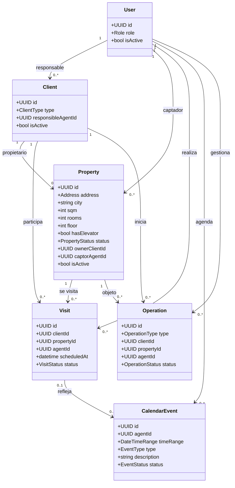

# Modelo de Dominio — CRM Inmobiliario Familiar

## 1. Objetivo

Este documento describe el **modelo de dominio (DDD)** del CRM inmobiliario, alineado con el PRD.

El objetivo es:

* Identificar **entidades**, **agregados** y **Value Objects**.
* Definir **invariantes** (reglas del negocio) y **eventos de dominio**.
* Dejar una base estable para diseño técnico, modelo de datos y casos de uso.

> Nota: el dominio se implementa en el backend (API). El frontend no contiene reglas de negocio.

---

## 2. Núcleo del negocio (Core Domain)

El dominio central del sistema es la **gestión del tiempo y la relación comercial**:

* **Agenda** como centro operativo.
* **Visitas** como evento principal del negocio.
* **Operaciones** como seguimiento hasta cierre/cancelación.

Los módulos de **Clientes** y **Propiedades** sostienen el contexto y la trazabilidad.

---

## 3. Bounded Contexts (límites conceptuales)

> Son límites lógicos dentro del backend (no microservicios).

1. **Identity & Access**
2. **Clientes**
3. **Propiedades**
4. **Agenda** ⭐
5. **Visitas** ⭐
6. **Operaciones** ⭐
7. **Escaparate (Publicación)** (read-only)

---

## 4. Lenguaje ubicuo (Ubiquitous Language)

* **Agente responsable**: usuario empleado que “lleva” una entidad (cliente/operación/visita/evento).
* **Agente captador**: agente que captó la propiedad.
* **Propietario**: cliente asociado a una propiedad.
* **Visita**: encuentro planificado/realizado entre cliente y propiedad.
* **Evento de agenda**: bloque de tiempo (visita, nota, captación, recordatorio).
* **Operación**: intención real de venta/alquiler con estados.
* **Observación**: texto libre con contexto humano, crítico para el negocio.

---

## 5. Agregados y entidades

### 5.1 Aggregate: User (Identity & Access)

**Entidad raíz:** `User`

**Atributos clave**

* `id`
* `role` (ADMIN | AGENT)
* `isActive`

**Reglas**

* No existe registro público.
* Un usuario desactivado no puede autenticarse.

---

### 5.2 Aggregate: Client (Clientes)

**Entidad raíz:** `Client`

**Atributos clave**

* `id`
* `type` (BUYER | TENANT | OWNER) *(puede ser múltiple si el negocio lo requiere)*
* `responsibleAgentId`
* `observations[]`
* `isActive`

**Relaciones**

* Puede ser **propietario** de 0..n propiedades.
* Tiene historial de visitas y operaciones.

**Reglas**

* Visibilidad: todos los agentes ven todos los clientes.
* Responsabilidad: cada cliente tiene un agente responsable.
* No se elimina: se desactiva.

---

### 5.3 Aggregate: Property (Propiedades)

**Entidad raíz:** `Property`

**Atributos clave**

* `id`
* `address`
* `city`
* `sqm`
* `rooms`
* `floor`
* `hasElevator`
* `status` (AVAILABLE | SOLD | RENTED)
* `ownerClientId`
* `captorAgentId`
* `observations[]`
* `isActive`

**Reglas**

* La propiedad se publica en escaparate **solo** si `status = AVAILABLE` y `isActive = true`.
* No se elimina: se desactiva.

---

### 5.4 Aggregate: Calendar (Agenda)

> La agenda es el centro del sistema. Modelamos agenda como un agregado que gestiona eventos.

**Entidad raíz:** `CalendarEvent`

**Atributos clave**

* `id`
* `agentId` (dueño del evento)
* `timeRange` (inicio/fin)
* `type` (VISIT | NOTE | CAPTATION | REMINDER)
* `description`
* `observations[]`
* `linkedEntity` (opcional: visitId / clientId / propertyId / operationId)
* `status` (ACTIVE | CANCELLED)

**Reglas**

* Permisos:

  * Agente: solo su agenda.
  * Admin: todas las agendas.
* La vista principal tras login es el calendario.

---

### 5.5 Aggregate: Visit (Visitas)

**Entidad raíz:** `Visit`

**Atributos clave**

* `id`
* `clientId`
* `propertyId`
* `agentId`
* `scheduledAt`
* `status` (PENDING | DONE | CANCELLED)
* `postVisitNotes` (observaciones posteriores)

**Relaciones**

* Suele tener vínculo con un `CalendarEvent` (1:1 recomendado).

**Reglas**

* Crear visita implica:

  * Registrar la visita
  * Reflejarla en agenda (evento tipo VISIT)
* Historial permanente.

---

### 5.6 Aggregate: Operation (Operaciones)

**Entidad raíz:** `Operation`

**Atributos clave**

* `id`
* `type` (SALE | RENT)
* `clientId`
* `propertyId`
* `agentId`
* `status` (INTEREST | NEGOTIATION | RESERVED | CLOSED | CANCELLED)
* `observations[]`
* `history[]` (cambios de estado)

**Reglas**

* Al cerrar una operación:

  * Si `type = SALE` → propiedad pasa a `SOLD`
  * Si `type = RENT` → propiedad pasa a `RENTED`
* No incluye contabilidad/facturación.

---

## 6. Value Objects

* `Address` (calle, número, etc.)
* `DateTimeRange` (inicio, fin) — valida `inicio < fin`
* `Observation` (texto, autor, fecha)
* `Status` (enums del dominio)

> Observación: `Observation` es un VO transversal y debe existir en todos los agregados que el PRD menciona.

---

## 7. Eventos de dominio (Domain Events)

* `VisitScheduled` (se crea una visita)
* `VisitCompleted`
* `VisitCancelled`
* `OperationStatusChanged`
* `OperationClosed`
* `PropertyStatusChanged`
* `ClientAssignedToAgent`

Uso recomendado:

* Alimentar historial
* Auditoría
* Observabilidad (sin acoplar a infraestructura)

---

## 8. Invariantes (reglas duras)

1. **No borrado** de datos críticos: desactivar o cambiar estado.
2. Toda entidad relevante tiene **agente responsable**.
3. La agenda debe ser un **calendario** (vistas día/semana).
4. Una visita siempre referencia **cliente + propiedad + agente + fecha/hora**.
5. Cerrar operación actualiza estado de propiedad.
6. Escaparate es **solo lectura** y nunca expone datos internos (observaciones, historial).

---

## 9. Diagrama de dominio (Mermaid — clases)

---

**Fin del documento**
