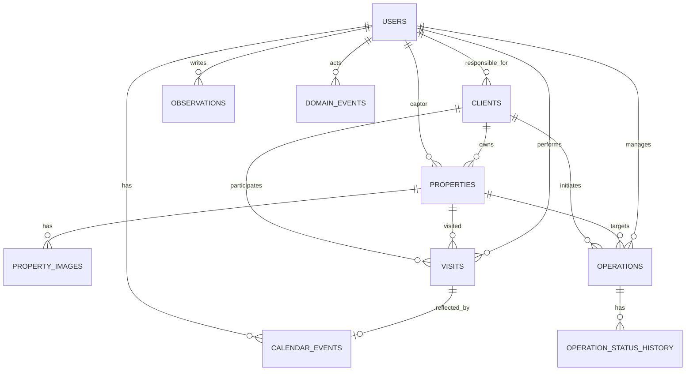

# Modelo de Datos — CRM Inmobiliario Familiar

## 1. Objetivo

Este documento define el **modelo de datos relacional** para el CRM inmobiliario.

Está alineado con:

* El PRD (no borrado de datos críticos, historial, seguridad, agenda central)
* El **Modelo de Dominio** (`docs/04_architecture/02_dominio.md`)
* La arquitectura (frontend como Web App; backend como API)

> Nota: el PRD define los campos mínimos de propiedad (dirección, ciudad, m², habitaciones, planta, ascensor, estado). Este modelo incorpora además campos prácticos para el **escaparate público**: **título/descripcion, precio y gestión de imágenes**.

---

## 3. Convenciones

### 3.1 Identificadores

* PK: `uuid`
* FKs: `*_id` (uuid)

### 3.2 Soft-delete / desactivación

* No se borran datos críticos.
* Se usa `is_active` + (cuando aplique) `status`.

### 3.3 Timestamps

* Tablas principales incluyen:

  * `created_at`
  * `updated_at`
  * `created_by_user_id` (recomendado para trazabilidad)

### 3.4 Observaciones

* Texto libre crítico y transversal.
* Se modela como tabla independiente `observations` vinculable a múltiples entidades.

### 3.5 Historial (auditoría de cambios)

* Cambios de estado relevantes se guardan como eventos en `domain_events` y/o tablas específicas (p.ej. `operation_status_history`).

---

## 4. Enumeraciones (dominio)

> En DB pueden implementarse como `ENUM` o `VARCHAR` con `CHECK`.

* `user_role`: `ADMIN`, `AGENT`
* `client_type`: `BUYER`, `TENANT`, `OWNER` *(si fuese múltiple, ver nota en Clientes)*
* `property_status`: `AVAILABLE`, `SOLD`, `RENTED`
* `visit_status`: `PENDING`, `DONE`, `CANCELLED`
* `event_type`: `VISIT`, `NOTE`, `CAPTATION`, `REMINDER`
* `event_status`: `ACTIVE`, `CANCELLED`
* `operation_type`: `SALE`, `RENT`
* `operation_status`: `INTEREST`, `NEGOTIATION`, `RESERVED`, `CLOSED`, `CANCELLED`

---

## 5. Tablas principales

### 5.1 `users`

Usuarios internos del sistema.

**Campos**

* `id` uuid PK
* `email` varchar unique not null
* `password_hash` varchar not null
* `role` user_role not null
* `is_active` bool not null default true
* `last_login_at` timestamptz null
* `created_at` timestamptz not null
* `updated_at` timestamptz not null

**Índices**

* `users(email)` unique
* `users(is_active)`

---

### 5.2 `clients`

Clientes del negocio (comprador/arrendatario/propietario).

**Campos**

* `id` uuid PK
* `full_name` varchar not null
* `phone` varchar null
* `email` varchar null
* `type` client_type not null
* `responsible_agent_id` uuid FK -> users(id) not null
* `is_active` bool not null default true
* `created_at`, `updated_at`

**Notas**

* Si un cliente puede ser múltiple tipo (p.ej. BUYER+OWNER), migrar a tabla puente `client_roles(client_id, role)`.

**Índices**

* `clients(responsible_agent_id)`
* `clients(type)`
* `clients(is_active)`
* Recomendado para búsquedas: índice en `full_name` y/o `phone` según queries.

---

### 5.3 `properties`

Inventario de propiedades. Debe soportar tanto el backoffice como el escaparate público.

**Campos (mínimos del PRD)**

* `id` uuid PK
* `address_line1` varchar not null
* `address_line2` varchar null
* `city` varchar not null
* `postal_code` varchar null
* `sqm` int not null  *(metros cuadrados)*
* `rooms` int not null
* `floor` int null
* `has_elevator` bool not null default false
* `status` property_status not null default 'AVAILABLE'
* `owner_client_id` uuid FK -> clients(id) not null
* `captor_agent_id` uuid FK -> users(id) not null
* `is_active` bool not null default true
* `created_at`, `updated_at`

**Campos adicionales recomendados (escaparate y operativa diaria)**

* `title` varchar not null *(título corto para listado: p.ej. “Piso luminoso 3 hab en Centro”)*
* `public_description` text null *(descripción para escaparate; NO incluye observaciones internas)*
* `internal_notes` text null *(opcional, si se quiere separar de `observations` en algunos casos)*
* `price_amount` numeric(12,2) null *(precio venta/alquiler)*
* `price_currency` char(3) not null default 'EUR'
* `is_published` bool not null default true *(control editorial del escaparate; ver reglas)*
* `lat` numeric(9,6) null
* `lng` numeric(9,6) null

**Reglas en DB (CHECK / integridad)**

* `sqm > 0`
* `rooms >= 0`
* `price_amount >= 0` cuando no sea null

**Reglas funcionales (aplicación)**

* Se muestra en escaparate si y solo si:

  * `is_active = true`
  * `is_published = true`
  * `status = AVAILABLE`

**Índices (clave para rendimiento)**

* Escaparate: `properties(city, status, is_published, is_active)`
* Backoffice: `properties(owner_client_id)`
* Backoffice: `properties(captor_agent_id)`

---

### 5.4 `property_images`

Imágenes asociadas a una propiedad para mostrar en escaparate.

**Campos**

* `id` uuid PK
* `property_id` uuid FK -> properties(id) not null
* `storage_key` varchar not null *(ruta/clave interna en almacenamiento)*
* `public_url` varchar null *(si el storage entrega URL pública firmada o CDN; opcional)*
* `caption` varchar null *(pie de foto)*
* `alt_text` varchar null *(accesibilidad)*
* `position` int not null default 0 *(orden en galería)*
* `is_cover` bool not null default false *(imagen principal)*
* `is_active` bool not null default true
* `created_at`, `updated_at`

**Reglas en DB (recomendadas)**

* `position >= 0`
* Unicidad recomendada: `(property_id, position)`
* Regla recomendada (app): solo una imagen con `is_cover = true` por propiedad.

**Índices**

* `property_images(property_id, position)`
* `property_images(property_id, is_cover)`

---

### 5.5 `calendar_events`

Agenda central (calendario). Representa visitas y otros bloques de tiempo.

**Campos**

* `id` uuid PK
* `agent_id` uuid FK -> users(id) not null
* `starts_at` timestamptz not null
* `ends_at` timestamptz not null
* `type` event_type not null
* `status` event_status not null default 'ACTIVE'
* `title` varchar not null
* `description` text null

**Vínculos opcionales** (solo uno debería estar presente)

* `visit_id` uuid FK -> visits(id) null
* `client_id` uuid FK -> clients(id) null
* `property_id` uuid FK -> properties(id) null
* `operation_id` uuid FK -> operations(id) null

**Trazabilidad**

* `created_at`, `updated_at`

**Reglas en DB**

* CHECK `starts_at < ends_at`
* Recomendación: constraint que asegure que como máximo uno de los `*_id` opcionales esté informado.

**Índices**

* `calendar_events(agent_id, starts_at)` *(agenda día/semana)*
* `calendar_events(status)`

---

### 5.6 `visits`

Visitas registradas (evento central).

**Campos**

* `id` uuid PK
* `client_id` uuid FK -> clients(id) not null
* `property_id` uuid FK -> properties(id) not null
* `agent_id` uuid FK -> users(id) not null
* `scheduled_at` timestamptz not null
* `status` visit_status not null default 'PENDING'
* `status` visit_status not null default 'PENDING'
* `created_at`, `updated_at`

**Índices**

* `visits(agent_id, scheduled_at)`
* `visits(client_id, scheduled_at)`
* `visits(property_id, scheduled_at)`
* `visits(status)`

**Regla funcional (aplicación)**

* Al crear visita, crear/actualizar `calendar_events` de tipo `VISIT`.

---

### 5.7 `operations`

Seguimiento comercial de venta/alquiler.

**Campos**

* `id` uuid PK
* `type` operation_type not null
* `client_id` uuid FK -> clients(id) not null
* `property_id` uuid FK -> properties(id) not null
* `agent_id` uuid FK -> users(id) not null
* `status` operation_status not null default 'INTEREST'
* `is_active` bool not null default true
* `created_at`, `updated_at`

**Índices**

* `operations(agent_id, status)`
* `operations(client_id, status)`
* `operations(property_id, status)`

**Regla funcional (aplicación)**

* Al pasar a `CLOSED`:

  * Si `type=SALE` -> `properties.status=SOLD`
  * Si `type=RENT` -> `properties.status=RENTED`

---

## 6. Tablas transversales

### 6.1 `observations`

Observaciones libres y auditables para cualquier entidad.

**Campos**

* `id` uuid PK
* `entity_type` varchar not null  *(CLIENT | PROPERTY | VISIT | OPERATION | CALENDAR_EVENT)*
* `entity_id` uuid not null
* `text` text not null
* `author_user_id` uuid FK -> users(id) not null
* `created_at` timestamptz not null

**Índices**

* `observations(entity_type, entity_id, created_at)`

**Notas**

* **Decisión de Implementación:** Se opta por la **Opción B: Tablas de observaciones por entidad** (`property_notes`, `client_notes`, `operation_notes`, `visit_notes`) para garantizar la máxima integridad referencial (Foreign Keys reales) y facilitar consultas específicas.

---

### 6.2 `domain_events`

Registro de eventos de dominio para historial y auditoría.

**Campos**

* `id` uuid PK
* `event_type` varchar not null
* `entity_type` varchar not null
* `entity_id` uuid not null
* `payload_json` jsonb not null
* `occurred_at` timestamptz not null
* `actor_user_id` uuid FK -> users(id) null

**Índices**

* `domain_events(entity_type, entity_id, occurred_at)`
* `domain_events(event_type, occurred_at)`

---

### 6.3 `operation_status_history` *(recomendado)*

Historial explícito de cambios de estado de una operación.

**Campos**

* `id` uuid PK
* `operation_id` uuid FK -> operations(id) not null
* `from_status` operation_status not null
* `to_status` operation_status not null
* `changed_at` timestamptz not null
* `changed_by_user_id` uuid FK -> users(id) not null
* `note` text null

**Índices**

* `operation_status_history(operation_id, changed_at)`

---

## 7. Diagrama ER (Mermaid)

---

## 8. Notas de implementación (no vinculantes)

* Consultas críticas: **agenda** (día/semana/mes). Priorizar índices por `agent_id + starts_at`.
* Escaparate: filtrar por `city`, `status`, `price_amount` (si aplica) y `rooms/sqm`.
* Imágenes: recomendable almacenamiento tipo S3/compatible + URLs firmadas/CDN (detalle a decidir en ADR/Operations).

---

**Fin del documento**
